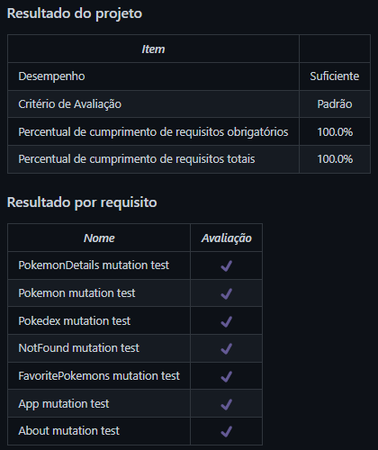

# React Testing Library
Projeto da [Trybe](https://www.betrybe.com/) - Bloco 14 - Criação de testes para uma aplicação de Pokédex utilizando React Testing Library.

## 💻 Projeto

Criação de testes com React Testing Library para uma aplicação de Pokédex.

<details>
  <summary><strong>🏆 Meu desempenho</strong></summary><br />

  
</details>

## 🚀 Tecnologias
> Este projeto foi desenvolvido com as seguintes tecnologias:

- JavaScript
- React
- React Testing Library

## 📌 Habilidades

> Neste projeto, desenvolvi as seguintes habilidades:

- Utilizar os seletores da React Testing Library em testes automatizados;
- Simular eventos com a React-Testing-Library em testes automatizados;
- Testar fluxos lógicos assíncronos com a React Testing Library;
- Escrever testes que permitam a refatoração da estrutura dos componentes da aplicação sem necessidade de serem alterados;
- Criar mocks de APIs utilizando fetch.
- Testar inputs.

## ⬇️ Instalando dependências

```bash
npm install
``` 

## ⚡ Executando a aplicação
Como o projeto consiste na criação de testes, inicialmente é necessário executar a aplicação:
```bash
npm start
``` 

E então executar os testes:
```bash
npm test
```


## 🧪 Executando os testes
Para "testar os testes", ou seja, para verificar se os testes criados realmente estão cumprindo o seu papel, foi utilizada a biblioteca [Stryker Mutator](https://stryker-mutator.io).
Para executá-la, utiliza-se o comando abaixo para cada um dos arquivos de configuração localizados na pasta `./stryker`:

```bash
npx stryker run ./stryker/nomeDoArquivo.conf.json
```

## 💬 Contatos

<div align="center" style="display: inline_block">
  <a href="https://julianoboese.github.io" target="_blank"></a> 
  <a href="https://www.linkedin.com/in/julianoboese" target="_blank"></a> 
  <a href = "mailto:juliano.boese@gmail.com"></a>
</div>

<!-- ## 📄 Licença

Esse projeto está sob licença. Veja o arquivo [LICENÇA](LICENSE.md) para mais detalhes.

[⬆ Voltar ao topo](#nome-do-projeto)<br> -->
